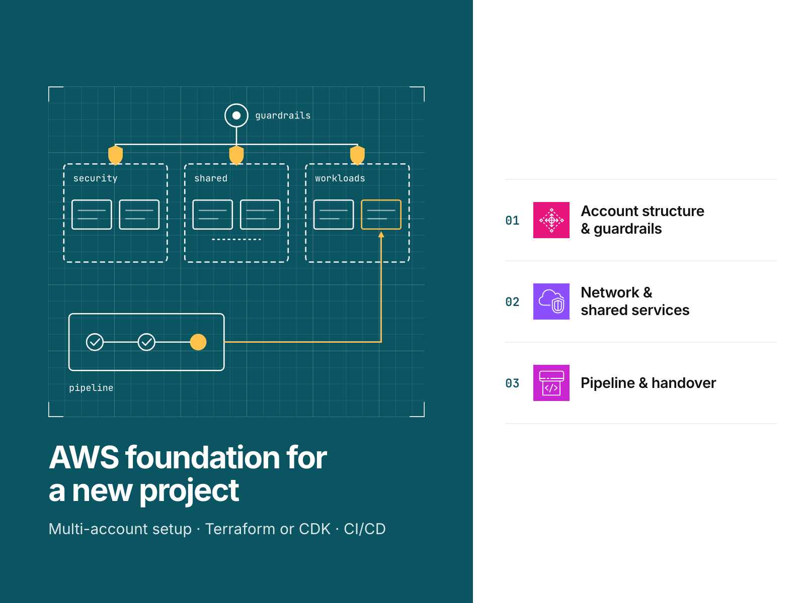
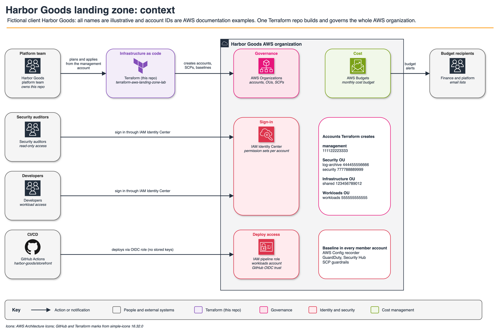
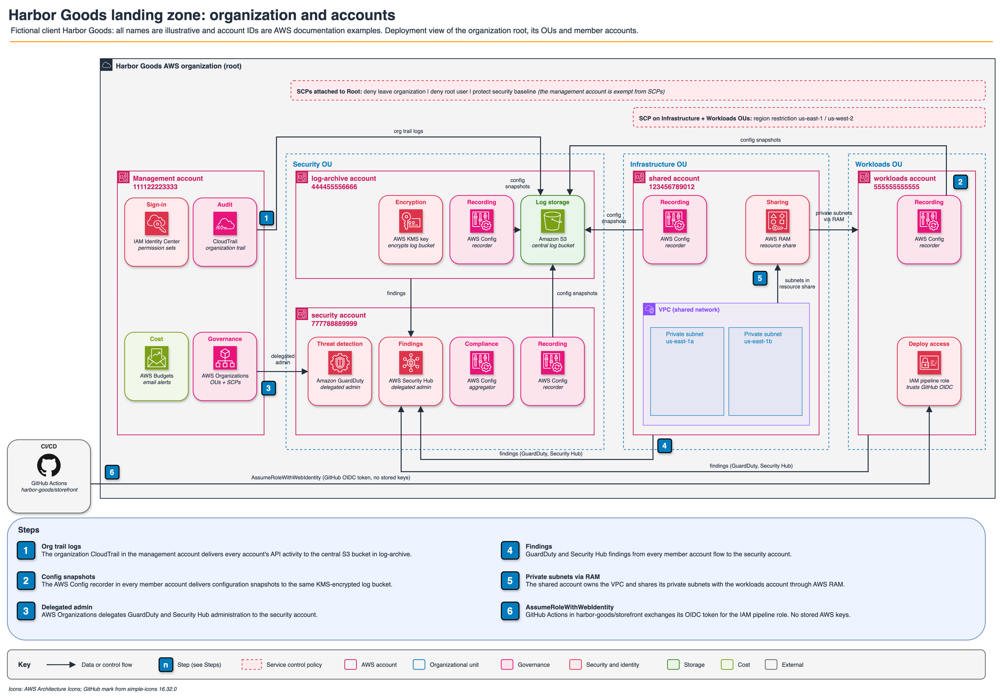

# AWS landing zone in Terraform

This repository defines a multi-account AWS foundation for a new project using Terraform and AWS Organizations, with
offline verification.

[](https://github.com/gamaware/terraform-aws-landing-zone-lab/actions/workflows/ci.yml)
[](LICENSE)




> **Lab.** Harbor Goods and all data here are fictional. Each repository in this portfolio is a
> separate engagement with Harbor Goods, a fictional mid-size retailer. Account IDs are AWS documentation examples.

## What this proves

- Five accounts (management, log-archive, security, shared, workloads) are organized across three OUs. Tests evaluate
  the effects of four service control policies against individual requests.
- Member accounts cannot disable auditing or detection. An organization CloudTrail writes to a locked log archive,
  each member account runs AWS Config, and the delegated security account manages GuardDuty and Security Hub.
- People receive IAM Identity Center permission sets, while the pipeline uses a GitHub OIDC role restricted to exact
  subjects and constrained by a permissions boundary. Neither access path requires long-lived keys.
- Teams get separate state for each account, region and stack, thin roots built on ten tested modules, and a runbook
  that specifies deployment checkpoints and rollback triggers.
- Without AWS credentials, `make verify` completes 54 mocked-provider Terraform tests, 26 SCP tests, a backend key
  test, tflint and Checkov in roughly a minute.

## Inspect the deliverable

| Artifact | What to look at |
| --- | --- |
| [`policies/scp/`](policies/scp/) and [`tests/policies/test_scps.py`](tests/policies/test_scps.py) | The guardrails and the requests each one must deny or allow |
| [`modules/organization/`](modules/organization/main.tf) | OUs, accounts with `prevent_destroy`, SCP attachments, delegated administrators |
| [`modules/log-archive/`](modules/log-archive/main.tf) | Bucket and key policies pinned to the trail ARN and organization ID |
| [`modules/pipeline-role/`](modules/pipeline-role/main.tf) | OIDC trust with exact subjects and a boundary that scopes `iam:PassRole` and S3 to named resources |
| [`environments/`](environments/) | The thin roots, one per account, region and stack |
| [`docs/runbook.md`](docs/runbook.md) | First deployment in order, with checkpoints and acceptance criteria |
| [`docs/adr/`](docs/adr/README.md) | Why raw Organizations instead of Control Tower, and five other decisions |

## Scenario and acceptance criteria

Harbor Goods is starting a new project on AWS and wants it to run in its own organization, beginning with one empty
management account. The project team includes a small platform team, a security reviewer and developers deploying
through GitHub. The requirements are account separation
for workloads, logs and security; single sign-on; preventive guardrails against risky changes; and billing that can
be read by account.

The implementation must use Terraform and allow two regions: `us-east-1` as the home region and `us-west-2` for
recovery. Control Tower is excluded, as explained in
[ADR 0001](docs/adr/0001-raw-organizations-instead-of-control-tower.md), and CI must not store AWS keys.

The example account IDs map to these accounts:

| Account | Example ID |
| --- | --- |
| Management | 111122223333 |
| Log archive | 444455556666 |
| Security | 777788889999 |
| Shared | 123456789012 |
| Workloads | 555555555555 |

Acceptance requires the following:

1. Member accounts occupy their designated OUs and are prevented from leaving the organization.
2. Member-account developer and pipeline roles are blocked from stopping CloudTrail, AWS Config, GuardDuty or
   Security Hub, and from creating regional resources beyond the approved regions.
3. The log-archive bucket receives organization trail logs and Config snapshots encrypted with its KMS key.
   Deletion and bucket-policy changes are restricted to the management access role.
4. The security account receives findings from all accounts.
5. Human access is exclusively through Identity Center groups, with admin sessions limited to one hour.
6. Only the `production` environment in `harbor-goods/storefront` can assume the pipeline role.
7. Alerts trigger when actual spend reaches 80% and 100% of budget, and when forecast spend reaches 100%.

These criteria are the single acceptance list; [the runbook](docs/runbook.md#acceptance-criteria) refers to them.
Offline verification through `make verify` covers criteria 1-3, 5 and 6. In a sandbox account, `make test-live`
additionally checks log bucket encryption and pipeline trust. Criteria 4 and 7 require a real organization;
see [Limits](#limits-and-production-adaptations).

## Architecture





From the management account, the platform team applies Terraform to establish the organization, accounts, SCPs and
per-account baselines. IAM Identity Center provides the only human access path, and GitHub Actions accesses the
workloads account exclusively through an OIDC role. The log-archive account receives logs; the security account
receives findings. This separation keeps both independent of the accounts under observation.



The draw.io source files and their PNG and SVG exports are available together in [`docs/diagrams/`](docs/diagrams/).

## Verify locally

The prerequisites below show the versions used for repository development and verification:

| Tool | Version |
| --- | --- |
| Terraform | 1.14.5 (AWS provider 6.66.0, locked) |
| TFLint | 0.61.0 with the AWS ruleset 0.49.0 |
| Checkov | 3.3.19 (run through `uvx`) |
| uv | 0.12 or later |
| Python | 3.13, standard library only |
| GNU Make, Bash | any recent |

```bash
make verify
```

After the initial provider download, the following output should appear in roughly a minute:

```text
modules/budgets                  Success! 3 passed, 0 failed.
...
modules/security-services        Success! 2 passed, 0 failed.
Ran 26 tests in 0.004s
OK
...
Ran 3 tests in 0.004s
OK
Passed checks: 327, Failed checks: 0, Skipped checks: 48
Only example account IDs found.
verify: all checks passed
```

Individual targets are listed by `make help`: `fmt`, `validate`, `lint`, `test`, `policy-test`, `structure-test`,
`private-live-test`, `checkov` and `example-ids`.

### Optional live test

In a sandbox account, `make test-live` deploys modules whose resources can be created and removed within a single
run: the log archive bucket and key, a VPC without NAT, the pipeline role and one budget. AWS CLI checks verify
these resources before an exit trap destroys them. AWS Organizations, accounts, SCPs, Identity Center and the
organization trail remain untouched because account closure takes 90 days and organization changes affect all
accounts.

```bash
aws sts get-caller-identity --profile dev
CONFIRM_LIVE=yes LIVE_ACCOUNT_ID=<sandbox account id> make test-live
```

Both variables are mandatory for the test to start. Every resource receives `purpose=portfolio-test` and a run ID;
any remaining tagged resource causes failure. State resides in a temporary directory outside the repository.

Live tests run private-only. The VPC has no internet gateway, public subnet or NAT gateway, and
`scripts/check_private_plan.py` refuses the saved plan before `terraform apply` if any resource would be
internet-facing or use Route 53. `make verify` runs the same rules offline.

## Repository map

```text
.
├── bootstrap/                 state bucket (S3 native locking), local state until migrated
├── environments/
│   ├── backend.hcl            shared backend settings
│   └── <account>/us-east-1/<stack>/
│                              thin roots: organization, org-trail, identity-center, budgets,
│                              log-archive, security-services, network, pipeline-role, baseline
├── modules/<name>/            ten modules, each with examples/basic and tests/*.tftest.hcl
├── policies/scp/              SCP JSON attached by the organization stack
├── tests/
│   ├── policies/              SCP structure tests and a small Deny-only evaluator
│   ├── structure/             backend key test: one unique key per root
│   └── live/                  opt-in live test root
├── scripts/                   test-live.sh, check-example-ids.sh
└── docs/                      ADRs, runbook, diagrams, cover
```

## Decisions and trade-offs

Architecture decision records follow the *Fundamentals of Software Architecture* (2nd ed.) format.

| Number | Title | Status |
| --- | --- | --- |
| [0001](docs/adr/0001-raw-organizations-instead-of-control-tower.md) | Raw AWS Organizations instead of AWS Control Tower | Accepted |
| [0002](docs/adr/0002-account-region-stack-composition.md) | One state per account, region and stack | Accepted |
| [0003](docs/adr/0003-scp-guardrail-design.md) | Deny-list SCPs with one management access role exemption | Accepted |
| [0004](docs/adr/0004-single-home-region.md) | One home region, a second approved region | Accepted |
| [0005](docs/adr/0005-offline-verification-and-live-scope.md) | Offline verification by default, a narrow live test | Accepted |
| [0006](docs/adr/0006-delegated-administration.md) | Security tooling runs from a delegated administrator account | Accepted |
| [0007](docs/adr/0007-s3-data-events-instead-of-server-access-logs.md) | S3 data events instead of S3 server access logs | Accepted |

Clients seeking AWS management of the landing zone lifecycle or access to its control library can use AWS Control
Tower, the managed alternative. ADR 0001 documents this lab's choice to work directly with Organizations and the
path for a later migration.

## Security and quality gates

| Gate | Where | Why |
| --- | --- | --- |
| `terraform fmt`, `validate` on every root and example | `make verify`, CI `terraform` | Broken roots never merge |
| tflint (all Terraform rules, AWS ruleset) | `make verify`, CI | Typed, documented inputs; standard module structure |
| `terraform test`, mocked AWS provider | `make verify`, CI | Tests what each module decides: targets, conditions, validations |
| SCP policy tests | `make verify` | Each guardrail denies and allows the right requests |
| Backend key test | `make verify` | Each root keeps its own state key, derived from its path |
| Checkov, skips only next to the resource with a reason | `make verify`, CI `security` | Misconfiguration scan of every module and stack |
| Example-ID guard | `make verify`, pre-commit | No real account ID can land in the repository |
| Semgrep, Trivy, gitleaks, markdownlint, Vale, actionlint, zizmor | CI shared workflows, pre-commit | Code, secrets, docs and workflow hygiene |

At workflow scope, CI sets `permissions: {}`; each job receives read-only permissions. All actions are pinned to
SHAs, and CI has neither AWS credentials nor `id-token` permission.

## Limits and production adaptations

- Mock tests establish the requests the code makes to AWS; AWS acceptance remains unproven. Live testing is limited
  to resources outside AWS Organizations. Verification of the organization, SCP attachments, delegations and trail
  is entirely offline.
- The SCP evaluator accepts only the grammar used by these policies and rejects other grammar. Its scope falls
  short of a full IAM simulator.
- Following the runbook sequence, operators manually transfer cross-stack values into `terraform.tfvars`. A real
  engagement adds SSM parameters or a thin wrapper, plans on PRs, and pipeline-driven applies with an approval gate.
- Deployment covers a single region. The log archive uses neither cross-region replication nor S3 Object Lock.
- Identity Center remains in the management account, with manually created groups. Production would use delegation
  and synchronize groups from the client's identity provider.
- Budget notifications are email-only, with no automated budget actions configured.

## Related work

This repository belongs to the [AWS DevOps portfolio](https://github.com/gamaware/aws-devops-portfolio) and supports
the service [AWS landing zone for a new project on Upwork](https://www.upwork.com/freelancers/~014b3520cf9e140103).
The method is the one Alex uses in audits for ITESO and freelance clients in Guadalajara.

## License

[MIT](LICENSE)
